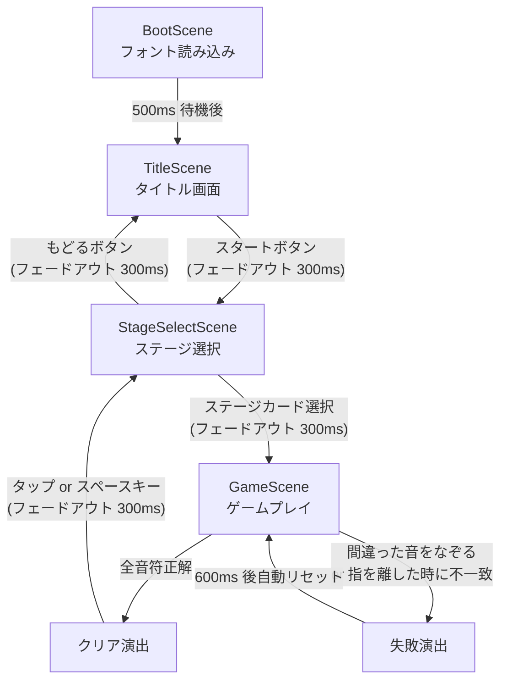
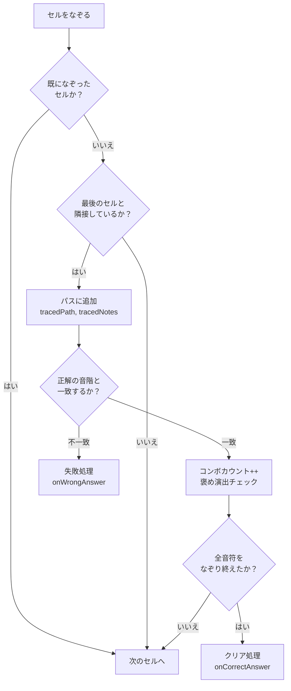
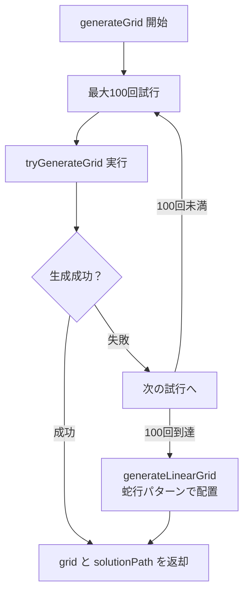

# Melody Trace（メロディトレース） ゲーム仕様書

**バージョン:** 1.0.0  
**最終更新:** 2026年2月8日  
**プロジェクト名:** melody-trace

---

## 目次

1. [ゲーム概要](#1-ゲーム概要)
2. [画面遷移](#2-画面遷移)
3. [各画面の詳細仕様](#3-各画面の詳細仕様)
4. [ゲームメカニクス詳細](#4-ゲームメカニクス詳細)
5. [ステージデータ仕様](#5-ステージデータ仕様)
6. [音階・色彩マッピング](#6-音階色彩マッピング)
7. [ビジュアル演出仕様](#7-ビジュアル演出仕様)
8. [入力システム](#8-入力システム)
9. [オーディオシステム](#9-オーディオシステム)
10. [技術仕様](#10-技術仕様)

---

## 1. ゲーム概要

| 項目 | 内容 |
|------|------|
| タイトル | Melody Trace（メロディトレース） |
| サブタイトル | 音階パズル |
| ジャンル | 音楽一筆書きパズル |
| プラットフォーム | モバイルWeb（スマートフォンブラウザ） |
| 画面サイズ | 390 x 844 px（ポートレート固定） |
| スケーリング | `Phaser.Scale.FIT`（画面フィット + 中央配置） |
| 対応入力 | タッチ操作 / マウス操作 |

### コンセプト

6x6 のグリッド上に並んだ音符セルを **一筆書き** でなぞり、お題のメロディを正確に再現するパズルゲーム。各セルにはドレミの音階名が表示されており、正しい順序でなぞることでメロディが完成する。間違った音をなぞると即座に失敗となり、素早くリトライできる設計。

### デザイン思想

桜井政博氏のゲームデザイン哲学に基づき、以下の原則を採用:

- **プレイヤーを褒める**: 正解時に「いいね！」「Great!」「Perfect!」等のフィードバック
- **パリッとしたエフェクト**: 音波リング、キラキラパーティクル等の強い視覚反応
- **迅速なリトライ**: 失敗後 600ms で自動リセットし、テンポを維持
- **明確な情報伝達**: 開始セルのパルス表示、進捗状況のリアルタイム表示

---

## 2. 画面遷移



### 画面遷移の共通仕様

| 項目 | 値 |
|------|-----|
| フェードイン時間 | 300ms |
| フェードアウト時間 | 300ms |
| 遷移待機時間 | フェードアウト完了後（300ms 後） |

---

## 3. 各画面の詳細仕様

### 3.1 BootScene（起動画面）

**ファイル:** `src/scenes/BootScene.js`

| 項目 | 内容 |
|------|------|
| 役割 | フォント読み込み、アセットのプリロード |
| プログレスバー | 画面中央、幅 320px、高さ 50px、色 `#4d96ff` |
| 読み込みフォント | KeiFont（`assets/k-font/keifont.ttf`） |
| フォント読み込み方式 | `FontFace` API |
| 遷移条件 | ロード完了後 500ms 待機してから TitleScene へ |

### 3.2 TitleScene（タイトル画面）

**ファイル:** `src/scenes/TitleScene.js`

#### レイアウト

| 要素 | 位置 | スタイル |
|------|------|---------|
| タイトル "Melody Trace" | X: 中央, Y: 30% | KeiFont 42px, 白, 黒ストローク 6px |
| サブタイトル "音階パズル" | X: 中央, Y: 38% | KeiFont 22px, `#aaaaaa` |
| 音符アニメーション | X: 20%〜80%, Y: 55% | `♪` `♫` `♬` x5個、36px |
| スタートボタン | X: 中央, Y: 75% | 200x60px、角丸 16px、`#4d96ff` |

#### 背景演出

- 装飾用の円: 8個、ランダム配置、NOTE_COLORS から色取得、透明度 0.15
- 各円は上下にゆらゆらアニメーション（2000〜4000ms、Sine.easeInOut、無限ループ）

#### 音符アニメーション

- 5つの音符記号が Y 方向に跳ねるアニメーション
- 各音符の色: `#ff6b6b`, `#ffd93d`, `#4d96ff`, `#6bcb77`, `#a855f7`
- 跳ね幅: -20px、周期 500ms、開始ディレイ: `i * 100ms`

#### スタートボタン

- パルスアニメーション: スケール 1.0 → 1.05（800ms、無限ループ）
- 押下時: スケール 0.95（50ms）
- 離す時: スケール 1.0（100ms）→ StageSelectScene へ遷移

### 3.3 StageSelectScene（ステージ選択画面）

**ファイル:** `src/scenes/StageSelectScene.js`

#### レイアウト

| 要素 | 位置 | スタイル |
|------|------|---------|
| ヘッダー "ステージ選択" | X: 中央, Y: 80px | KeiFont 36px |
| サブヘッダー "演奏する曲を選ぼう" | X: 中央, Y: 125px | KeiFont 18px, `#aaaaaa` |
| ステージカード | X: 中央, Y: 200px から | 320x140px、間隔 30px |
| もどるボタン | X: 中央, Y: H-80px | 140x46px、角丸 12px |

#### ステージカードの構成

各カードは以下の要素で構成:

| 要素 | 詳細 |
|------|------|
| カード背景 | `#1e2a4a`（透明度 0.95）、角丸 20px |
| カード影 | `#000000`（透明度 0.3）、オフセット (+6, +8) |
| 左アクセントバー | 幅 8px、ステージ固有カラー |
| 上部ハイライト | 白、透明度 0.08 |
| ステージ番号 | 円形背景（アクセント色 20%）+ 番号テキスト 28px |
| アイコン | ステージ固有の絵文字 |
| 曲名 | KeiFont 26px |
| ヒント | KeiFont 16px, `#cccccc` |
| 説明文 | KeiFont 14px, `#888888` |
| 音符数 | `♪×N` 形式、KeiFont 14px, `#666666` |

#### ステージカードのスタイル定義

| ステージ | アイコン | アクセント色 | 説明文 |
|---------|--------|------------|--------|
| きらきら星 | ⭐ | `#ffd93d` | "一筆書きでメロディを奏でよう" |
| よろこびの歌 | 🎵 | `#4d96ff` | "ベートーヴェンの名曲" |
| ジングルベル | 🔔 | `#c41e3a` | "おなじみのクリスマスソング" |
| ロンドン橋 | 🌉 | `#ff6b6b` | "イギリスのわらべうた" |

#### カードアニメーション

- **登場**: alpha 0→1, Y +40px→0（400ms, Cubic.easeOut, ディレイ 100 + index * 120ms）
- **ホバー**: スケール 1.03（150ms, Sine.easeOut）
- **押下**: スケール 0.96（80ms）
- **離す**: スケール 1.0（100ms）→ GameScene へ遷移

#### もどるボタン

- 背景色: `#444444`
- テキスト: "← もどる"（20px）
- 押下でスケール 0.95 → TitleScene へ遷移

### 3.4 GameScene（ゲームプレイ画面）

**ファイル:** `src/scenes/GameScene.js`（1149行）

#### レイアウト

| 要素 | 位置 | スタイル |
|------|------|---------|
| ステージタイトル | X: 中央, Y: SAFE_TOP+30 | KeiFont 32px |
| グリッド | X: 中央, Y: 画面 32% | 6x6、背景パディング 15px |
| "なぞった音:" ラベル | X: 中央, Y: H-SAFE_BOTTOM-120 | KeiFont 16px, `#888888` |
| なぞった音表示 | X: 中央, Y: ラベル+35px | KeiFont 18px, 折り返し幅 350px |
| リセットボタン | X: 中央, Y: H-SAFE_BOTTOM-40 | 120x40px、角丸 10px |

#### 初期化処理 (`init`)

ステージ選択から `stageKey` を受け取り（デフォルト: `twinkleStar`）、以下を初期化:

- `generateGrid()` でグリッドと解答パスを自動生成
- 一筆書き状態変数: `isDrawing`, `tracedPath`, `tracedNotes`
- グリッドセル参照: `cells`（2D配列）, `cellContainers`（フラット配列）
- 描画レイヤー: `lineGraphics`（depth: 5）, `glowGraphics`（depth: 4）
- ゲーム状態: `gameEnded`, `comboCount`

#### 背景の構成

| レイヤー | 内容 | depth |
|---------|------|-------|
| グラデーション背景 | 深い青→紫の20段階グラデーション | -10 |
| 装飾の光の輪 | 3つの円（青、紫、ピンク）、呼吸アニメーション | -9 |
| 背景星パーティクル | 画面下→上に浮遊する星（初期15個、800ms間隔で追加） | -8 |

#### グリッドセルの構成

各セルは `Phaser.GameObjects.Container` で構成:

| 要素 | 詳細 |
|------|------|
| セル背景 | NOTE_COLORS に対応する色、角丸 10px |
| 上部ハイライト | 白、透明度 0.25 |
| 音階名テキスト | NOTE_NAMES の日本語名、KeiFont 18〜28px |
| 開始セルのグロー | 白円（透明度 0.3）、パルスアニメーション |
| 開始セルの枠 | 二重枠（外: 4px/50%, 内: 2px/100%）|
| 開始セルのパルス | スケール 1.0→1.12（500ms、無限ループ）|

**音階名のフォントサイズ判定:**
- 2文字以上（例: "ファ", "ド↑"）→ 22px
- 1文字（例: "ド", "レ"）→ 28px

---

## 4. ゲームメカニクス詳細

### 4.1 グリッド仕様

| 項目 | 値 |
|------|-----|
| グリッドサイズ | 6 x 6 |
| セルサイズ | 52 x 52 px |
| セル間ギャップ | 4 px |
| グリッド総サイズ | 332 x 332 px（(52+4)*6-4） |
| 背景パディング | 15 px |
| 背景色 | `#16213e`（透明度 0.8）|
| 背景角丸 | 16 px |

### 4.2 一筆書きルール

1. **開始**: プレイヤーは任意のセルをタッチして一筆書きを開始できる（ただし解答パスの開始セルが視覚的にハイライトされる）
2. **移動**: 8方向（上下左右 + 斜め4方向）の隣接セルのみに移動可能
3. **一筆書き制約**: 一度なぞったセルは再度なぞれない
4. **リアルタイム判定**: なぞった音が正解の音階と一致するか都度チェック
5. **即時失敗**: 間違った音をなぞった瞬間に一筆書きが停止し、失敗処理が実行される
6. **自動クリア**: 全音符を正しくなぞり終えた時点で自動的にクリア判定（指を離す必要なし）

### 4.3 隣接判定ロジック

```
隣接条件: |rowDiff| <= 1 かつ |colDiff| <= 1 かつ 自身と同じセルでないこと

8方向の移動ベクトル:
  [-1,-1] [-1, 0] [-1, 1]
  [ 0,-1]         [ 0, 1]
  [ 1,-1] [ 1, 0] [ 1, 1]
```

### 4.4 判定フロー



### 4.5 コンボ・進捗フィードバック

| 条件 | 演出 |
|------|------|
| 3連続正解 | "いいね！" ポップアップ |
| 6連続正解 | "Great!" ポップアップ + ミニスパークル |
| 9連続正解 | "♪" ポップアップ + ミニスパークル |
| 12連続正解 | "調子いい！" ポップアップ + ミニスパークル |
| 15連続正解 | "Perfect!" ポップアップ + ミニスパークル |
| 半分到達 | "Half Way!" マイルストーン演出 |
| 残り2音 | "あと少し！" マイルストーン演出 |

- 褒めメッセージは 3 の倍数ごとに表示（`comboCount % 3 === 0`）
- 6連続以降はスパークルエフェクト（5個の星）が追加
- メッセージ配列: `['いいね！', 'Great!', '♪', '調子いい！', 'Perfect!']`（ローテーション）

### 4.6 失敗時の処理

1. 一筆書きを即時停止（`isDrawing = false`）
2. カメラシェイク: 200ms、強度 0.015
3. なぞったセルを赤くフラッシュ（`#ff0000`、透明度 0.5、300ms でフェードアウト）
4. 600ms 後に自動リセット（`resetTrace()`）

### 4.7 クリア時の処理

1. `gameEnded = true` に設定
2. 画面フラッシュ（白、透明度 0.8、400ms でフェードアウト）
3. 経路ライトアップシーケンス（各セル 40ms 間隔で順番に光る）
4. 600ms 後に結果表示（`showResult(true)`）
5. 黒オーバーレイ（透明度 0→0.75、300ms）
6. "クリア！" テキスト表示（56px、`#ffd93d`、Back.easeOut で登場）
7. "素晴らしい演奏！" テキスト（300ms ディレイ後フェードイン）
8. 星バーストエフェクト（12個の星）
9. 紙吹雪エフェクト（50個のパーティクル）
10. 1200ms 後に戻るボタン表示（タップ or スペースキーで StageSelectScene へ）

---

## 5. ステージデータ仕様

### 5.1 データ構造

**ファイル:** `src/data/stages.js`

各ステージは以下のプロパティを持つ:

```javascript
{
    title: string,      // ステージ名（日本語）
    hint: string,       // ヒントテキスト（歌詞の一部等）
    answer: string[],   // 正解の音階配列（例: ['C4', 'G4', ...]）
}
```

`grid`（6x6の2D配列）と `solutionPath`（{row, col}の配列）は `generateGrid()` により自動生成される。

### 5.2 既存ステージ一覧

#### ステージ1: きらきら星（twinkleStar）

| 項目 | 内容 |
|------|------|
| タイトル | きらきら星 |
| ヒント | きらきらひかる おそらのほしよ |
| 音符数 | 14 |
| 正解配列 | C4, C4, G4, G4, A4, A4, G4, F4, F4, E4, E4, D4, D4, C4 |
| 使用音階 | C4, D4, E4, F4, G4, A4（6種） |

```
ド ド ソ ソ ラ ラ ソ ファ ファ ミ ミ レ レ ド
```

#### ステージ2: よろこびの歌（odeToJoy）

| 項目 | 内容 |
|------|------|
| タイトル | よろこびの歌 |
| ヒント | はれたるあおぞら ただよう くもよ |
| 音符数 | 30 |
| 正解配列 | E4, E4, F4, G4, G4, F4, E4, D4, C4, C4, D4, E4, E4, D4, D4, E4, E4, F4, G4, G4, F4, E4, D4, C4, C4, D4, E4, D4, C4, C4 |
| 使用音階 | C4, D4, E4, F4, G4（5種） |
| 出典 | ベートーヴェン「交響曲第9番」（1824年）※パブリックドメイン |

```
ミ ミ ファ ソ ソ ファ ミ レ ド ド レ ミ ミ レ レ
ミ ミ ファ ソ ソ ファ ミ レ ド ド レ ミ レ ド ド
```

#### ステージ3: ジングルベル（jingleBells）

| 項目 | 内容 |
|------|------|
| タイトル | ジングルベル |
| ヒント | ジングルベル ジングルベル すずがなる |
| 音符数 | 24 |
| 正解配列 | E4, E4, E4, E4, E4, E4, E4, G4, C4, D4, E4, F4, F4, F4, F4, F4, E4, E4, E4, G4, G4, F4, D4, C4 |
| 使用音階 | C4, D4, E4, F4, G4（5種） |
| 出典 | J.S.ピアポント（1857年）※パブリックドメイン |

```
ミ ミ ミ ミ ミ ミ ミ ソ ド レ ミ
ファ ファ ファ ファ ファ ミ ミ ミ ソ ソ ファ レ ド
```

### 5.3 グリッド自動生成アルゴリズム

**関数:** `generateGrid(answer, gridSize = 6)`



#### 生成ロジック（`tryGenerateGrid`）

1. 空の6x6グリッドを作成
2. スタート位置をランダムに決定（マージン1で中央寄り: 行1〜4、列1〜4）
3. 正解配列の各音を順番にグリッドに配置:
   - 8方向の移動先をシャッフルして探索
   - 未訪問かつ残りの音符数に十分な空きスペースがある移動先を候補にする
   - 候補をスペースの大きさ順にソートし、上位3つからランダム選択
   - 行き詰まった場合は `null` を返して再試行
4. 残りの空セルをダミー音符で埋める

#### ダミー音符の選定

- 正解に含まれない音階を優先的にダミーとして使用
- 全25音（C4〜C6）からランダムに選択

#### フォールバック（`generateLinearGrid`）

100回の試行で生成できなかった場合、蛇行パターン（左→右→折り返し→左→右...）で直線的に配置。

---

## 6. 音階・色彩マッピング

**ファイル:** `src/config.js`

### 6.1 音階一覧（25音: C4 〜 C6）

#### オクターブ1（C4 〜 B4）

| 音階ID | 日本語名 | 色名 | 色コード |
|--------|---------|------|---------|
| C4 | ド | 赤 | `#ff6b6b` |
| Cs4 | ド♯ | 濃い赤 | `#ff5252` |
| D4 | レ | オレンジ | `#ffa94d` |
| Ds4 | レ♯ | 濃いオレンジ | `#ff8c3a` |
| E4 | ミ | 黄 | `#ffd93d` |
| F4 | ファ | 緑 | `#6bcb77` |
| Fs4 | ファ♯ | 濃い緑 | `#4db866` |
| G4 | ソ | 青 | `#4d96ff` |
| Gs4 | ソ♯ | 濃い青 | `#3a7fee` |
| A4 | ラ | 藍 | `#6c5ce7` |
| As4 | ラ♯ | 濃い藍 | `#5a4bd6` |
| B4 | シ | 紫 | `#a855f7` |

#### オクターブ2（C5 〜 B5）

| 音階ID | 日本語名 | 色名 | 色コード |
|--------|---------|------|---------|
| C5 | ド↑ | ピンク | `#f472b6` |
| Cs5 | ド♯↑ | 濃いピンク | `#e855a0` |
| D5 | レ↑ | 明るいオレンジ | `#ffbd69` |
| Ds5 | レ♯↑ | やや濃いオレンジ | `#ffab4d` |
| E5 | ミ↑ | 明るい黄 | `#ffe066` |
| F5 | ファ↑ | 明るい緑 | `#51cf66` |
| Fs5 | ファ♯↑ | やや濃い緑 | `#40b858` |
| G5 | ソ↑ | 明るい青 | `#74b9ff` |
| Gs5 | ソ♯↑ | やや濃い青 | `#5da4ee` |
| A5 | ラ↑ | 明るい藍 | `#9b8ce7` |
| As5 | ラ♯↑ | やや濃い藍 | `#8a7bd6` |
| B5 | シ↑ | 明るい紫 | `#c084fc` |

#### C6

| 音階ID | 日本語名 | 色名 | 色コード |
|--------|---------|------|---------|
| C6 | ド↑↑ | ライトピンク | `#ff9ff3` |

### 6.2 配色設計

- レインボーグラデーション方式: ド(赤) → レ(橙) → ミ(黄) → ファ(緑) → ソ(青) → ラ(藍) → シ(紫)
- オクターブ2は同系色の明るいバリエーション
- シャープ（♯）は同音の濃いバリエーション
- 高オクターブ表記: `↑`（1オクターブ上）、`↑↑`（2オクターブ上）

---

## 7. ビジュアル演出仕様

### 7.1 セルハイライト演出（セルをなぞった時）

| 演出 | 詳細 |
|------|------|
| スケールバウンス | 1.0→1.2（80ms, Back.easeOut）→ 1.0（150ms, Bounce.easeOut）|
| 音波リング | 2重リング、半径 10→60/80px、300〜400ms、Cubic.easeOut |
| キラキラパーティクル | 8個の星形、放射状に30〜50px 飛散、250〜350ms |
| セル発光 | 外側に白い発光枠、上部ハイライト強化（透明度 0.4）|
| 音階名テキスト | 1.3倍に一瞬拡大（100ms、yoyo）|
| カメラ振動 | 30ms、強度 0.003 |
| depth 変更 | 1 → 10 |

### 7.2 パス描画

| レイヤー | 詳細 |
|---------|------|
| グロー（下層, depth:4） | 3段階の半透明白ライン（太さ 14〜26px、透明度 0.08〜0.24）|
| 白縁取り（中層, depth:5） | 太さ 10px、透明度 0.6 |
| カラーライン（上層, depth:5） | 太さ 6px、セグメントごとに色補間（各セグメント5分割グラデーション）|
| ノードポイント | 各ポイントに白縁（半径 7px）+ カラー中心（半径 5px）|

色補間は線形補間（RGB各成分を独立に補間）。

### 7.3 進捗フィードバック演出

#### 褒めメッセージ

- フォント: KeiFont 16px、色 `#ffd93d`、黒ストローク 3px
- アニメーション: スケール 0→1.2、Y -20px 上昇、600ms でフェードアウト（Cubic.easeOut）

#### ミニスパークル（6コンボ以降）

- 5個の星形（4角、内径2、外径4、色 `#ffd93d`）
- Y -30px 上昇、400ms でフェードアウト、50ms 間隔で順次発生

#### マイルストーン演出

- フォント: KeiFont 24px、白、`#4d96ff` ストローク 4px
- 登場: スケール 0→1（200ms, Back.easeOut）
- 消失: 300ms 待機後、alpha→0 + Y -30px（500ms）

### 7.4 クリア演出

| 演出 | タイミング | 詳細 |
|------|----------|------|
| 画面フラッシュ | 即時 | 白、透明度 0.8→0、400ms |
| パスライトアップ | 即時 | 各セル 40ms 間隔、白い光の輪（半径 10→50px）+ セルスケール 1.3 |
| 黒オーバーレイ | 600ms 後 | 透明度 0→0.75、300ms |
| "クリア！" テキスト | 600ms 後 | 56px, `#ffd93d`、スケール 0→1 + 回転 -0.1→0（400ms, Back.easeOut）|
| "素晴らしい演奏！" | 900ms 後 | 20px, 白、フェードイン + Y 微上昇（400ms）|
| 星バースト | 600ms 後 | 12個、放射状 80〜120px、3色（金/白/ピンク）、回転付き、600ms |
| 紙吹雪 | 600ms 後 | 50個、上→下に落下、横揺れ付き、NOTE_COLORS の全色使用 |

### 7.5 失敗演出

| 演出 | 詳細 |
|------|------|
| カメラシェイク | 200ms、強度 0.015 |
| 赤フラッシュ | なぞったセル全体に赤い矩形（透明度 0.5）、300ms でフェードアウト |

### 7.6 背景演出（GameScene）

| 要素 | 詳細 |
|------|------|
| グラデーション | 20段階、深い青（`#1a1a2e`）→紫系（`#2e104c`付近）|
| 光の輪 | 3個、色: `#4d96ff`, `#a855f7`, `#f472b6`、呼吸アニメーション（3000〜4000ms）|
| 背景星 | 初期 15個（200ms 間隔生成）、以降 800ms 間隔で追加、画面下→上へ浮遊（4000〜7000ms）|

---

## 8. 入力システム

### 8.1 入力イベント

| イベント | ハンドラ | 処理 |
|---------|---------|------|
| `pointerdown` | `onPointerDown` | タッチ/クリック開始。セル上なら一筆書き開始 |
| `pointermove` | `onPointerMove` | 指/カーソル移動。隣接する未なぞりセル上なら追加 |
| `pointerup` | `onPointerUp` | タッチ/クリック終了。正解チェック |
| `keydown-SPACE` | （クリア後のみ） | ステージ選択へ遷移 |

### 8.2 セル当たり判定

`getCellAtPosition(x, y)`:
- 全セルコンテナの `getBounds()` を取得
- ポインタ座標が矩形範囲内かを判定
- 最初にヒットしたセルを返却

### 8.3 リセットボタン

| 状態 | 動作 |
|------|------|
| ゲーム中 | `resetTrace()`: パス・状態をクリア、セルの見た目を初期状態に復元 |
| ゲーム終了後 | `scene.restart()`: シーン全体を再起動（グリッド再生成） |

### 8.4 リセット処理の詳細（`resetTrace`）

1. `tracedPath`, `tracedNotes`, `comboCount` をクリア
2. 全セルの `traced` フラグを `false` に
3. 全セルの tween を停止し、スケールを 1 に
4. セル背景を初期色に復元
5. 開始セルのグロー表示を復活、パルスアニメーション再開
6. 描画ラインをクリア
7. フッターの音表示を更新

---

## 9. オーディオシステム

### 9.1 現在の状態

オーディオ機能は **生成済みだがゲーム内未統合**。コード上に SE 再生処理は含まれていない。

### 9.2 音声ファイル生成方式

| スクリプト | 役割 |
|-----------|------|
| `generate_piano_all.py` | ElevenLabs API で C4〜C6 の全25音のピアノ音を生成 |
| `generate_piano_scales.py` | 特定の音（F#5, D5, E5）を個別生成 |
| `generate_from_c4.py` | C4 音を基準に ffmpeg でピッチシフトして他の音を生成 |

### 9.3 音声ファイル仕様

| 項目 | 値 |
|------|-----|
| フォーマット | MP3 |
| 音域 | C4 〜 C6（25音） |
| 保存先 | `assets/se/piano/` |
| 命名規則 | 音階名（例: `C4.mp3`, `Fs5.mp3`） |

### 9.4 外部サービス

| サービス | 用途 |
|---------|------|
| ElevenLabs API | ピアノ音の効果音生成 |
| ffmpeg | 音声のピッチシフト処理 |

API キーは `.env` ファイルで管理（`ELEVENLABS_API_KEY`）。

---

## 10. 技術仕様

### 10.1 技術スタック

| カテゴリ | 技術 | バージョン |
|---------|------|-----------|
| ゲームフレームワーク | Phaser.js | ^3.80.1 |
| ビルドツール | Vite | ^5.4.0 |
| 言語 | JavaScript（ES Modules） | ES6+ |
| フォント | KeiFont | - |
| 音声生成 | Python + ElevenLabs SDK | - |

### 10.2 ディレクトリ構成

```
melody-trace/
├── index.html                 # エントリHTML
├── package.json               # プロジェクト設定
├── vite.config.js             # Vite ビルド設定
├── .env                       # API キー（非公開）
├── src/
│   ├── main.js                # Phaser 初期化・シーン登録
│   ├── config.js              # ゲーム設定（定数・色・スタイル）
│   ├── data/
│   │   └── stages.js          # ステージデータ・グリッド生成
│   └── scenes/
│       ├── BootScene.js       # 起動・アセット読み込み
│       ├── TitleScene.js      # タイトル画面
│       ├── StageSelectScene.js # ステージ選択画面
│       └── GameScene.js       # メインゲームプレイ
├── assets/
│   ├── k-font/                # フォントファイル
│   │   └── keifont.ttf
│   └── se/
│       └── piano/             # ピアノ音声ファイル（生成物）
├── generate_piano_all.py      # 音声生成スクリプト（全音）
├── generate_piano_scales.py   # 音声生成スクリプト（個別）
└── generate_from_c4.py        # 音声生成スクリプト（ピッチシフト）
```

### 10.3 Phaser 初期設定

| 項目 | 値 |
|------|-----|
| レンダラ | `Phaser.AUTO`（WebGL 優先、Canvas フォールバック） |
| 画面幅 | 390px |
| 画面高さ | 844px |
| 背景色 | `#1a1a2e` |
| スケールモード | `Phaser.Scale.FIT` |
| 中央寄せ | `Phaser.Scale.CENTER_BOTH` |
| シーン登録順 | BootScene → TitleScene → StageSelectScene → GameScene |

### 10.4 Vite ビルド設定

| 項目 | 値 |
|------|-----|
| base | `./`（相対パス） |
| 開発サーバーポート | 5173 |
| ホスト公開 | `true`（LAN アクセス可） |
| 出力ディレクトリ | `dist/` |
| チャンク分割 | `phaser` を別チャンクに分離 |
| 依存関係の事前バンドル | `phaser` を `optimizeDeps.include` に指定 |

### 10.5 セーフエリア

| 方向 | 値 |
|------|-----|
| 上部 | 50px |
| 下部 | 34px |

### 10.6 テキストスタイル定義

| スタイル名 | フォント | サイズ | 色 | ストローク |
|-----------|---------|-------|-----|-----------|
| title | KeiFont | 48px | `#FFFFFF` | 黒 6px |
| subtitle | KeiFont | 24px | `#FFFFFF` | なし |
| button | KeiFont | 28px | `#FFFFFF` | `#00000055` 4px |
| note | KeiFont | 18px | `#FFFFFF` | 黒 3px |

### 10.7 NPM スクリプト

| コマンド | 動作 |
|---------|------|
| `npm run dev` | Vite 開発サーバー起動 |
| `npm run build` | プロダクションビルド |
| `npm run preview` | ビルド結果のプレビュー |

---

## 付録: 新ステージ追加手順

1. `src/data/stages.js` の `STAGES` オブジェクトに新しいエントリを追加:

```javascript
newStage: {
    title: 'ステージ名',
    hint: 'ヒントテキスト',
    answer: ['C4', 'D4', 'E4', ...],  // 正解の音階配列
},
```

2. （任意）`src/scenes/StageSelectScene.js` の `stageStyles` にアイコン・色・説明を追加:

```javascript
newStage: {
    icon: '🎵',
    accentColor: 0xff6b6b,
    description: '説明テキスト',
},
```

3. グリッドは `generateGrid()` により自動生成されるため、手動でのグリッド設計は不要。
